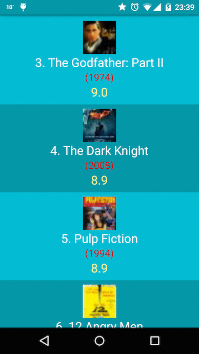

# Top Movies Material
Top Rate Movies with Material Design everywhere

# Overview
There are more suitable effects in material design philosophy, better transitions,
scroll view handling when moving the card of the movie, and colors palette applied to the
status bar when moving up and down as the pictures reflects. Some credits at the end in a
new fab button called “i” of information.
And all fab button are hidden or shown with the toolbar title depending on the move of your finger.

# Screenshots

# Disclosure - API and Libraries used
- [My API Films](http://www.myapifilms.com/) library updated which is not supported at this open source project (needs to update models and token)
- [ButterKnife](http://jakewharton.github.io/butterknife) v6.0.0 for Views Injection
- [Retrofit](http://square.github.io/retrofit) v1.6.1 for API requests
- [Universal Image Loader](https://github.com/bumptech/glide) v1.9.3 for Image rendering

# References
- [Material design everywhere](http://antonioleiva.com/material-design-everywhere/) by Antonio Leiva